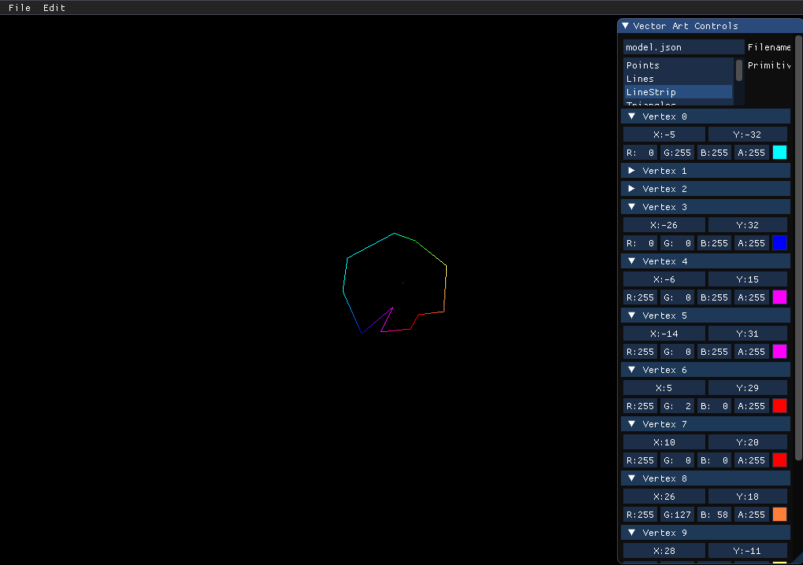

# vector-art


A program that allows you to create simple vector art and save it to a json file.
The json files are meant to be used to create SFML `sf::VertexArray` objects.



## Building

### Prerequisites

* C++17 compliant compiler
* [CMake 3.12+](https://cmake.org/download/)
* [Conan](https://conan.io/downloads.html)

### Setting up

```sh
git clone --recurse-submodules https://github.com/notskm/vector-art
cd vector-art
```

```sh
mkdir build
cd build
```

### Makefile generators (Make, Ninja, etc.)

```sh
cmake .. -GNinja -DCMAKE_BUILD_TYPE=Release
cmake --build .
```

### Multi generators (Visual Studio, etc.)

```sh
cmake .. -G "Visual Studio 16 2019"
cmake --build . --config Release
```

### CMake options

|       Option       | Default | Description                        |
| :----------------: | :-----: | ---------------------------------- |
|     RUN_CONAN      |   ON    | Runs `conan install` automatically |
| WARNINGS_AS_ERRORS |   OFF   | Treat compiler warnings as errors  |

## Authors

* [@notskm](https://github.com/notskm)

See also the list of [contributors](https://github.com/notskm/vector-art) who
participated in this project.
